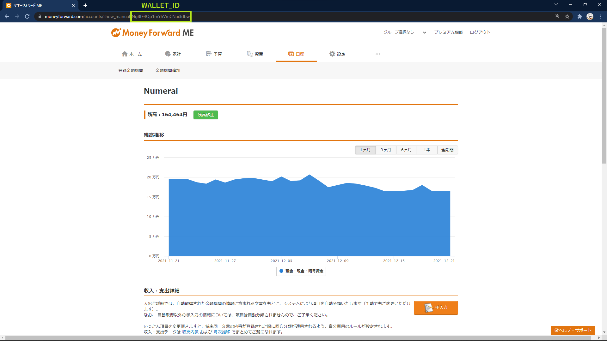

# nmr2mf

nmr2mf will automatically record your NMR on Numerai in Money Forward at every day.

## Settings

1. Fork this repository
2. [Create a new api key to allow viewing of user information in Numerai](https://numer.ai/account)
3. [Create a new wallet to record your NMR in Money Forward](https://moneyforward.com/accounts/new/wallet)
4. Add the following action secrets in GitHub (Settings > Secrets > New repository secret)

- MONEYFORWARD_EMAIL
- MONEYFORWARD_PASSWORD
- MONEYFORWARD_WALLET_ID
- NUMERAI_PUBLIC_ID
- NUMERAI_SECRET_KEY

